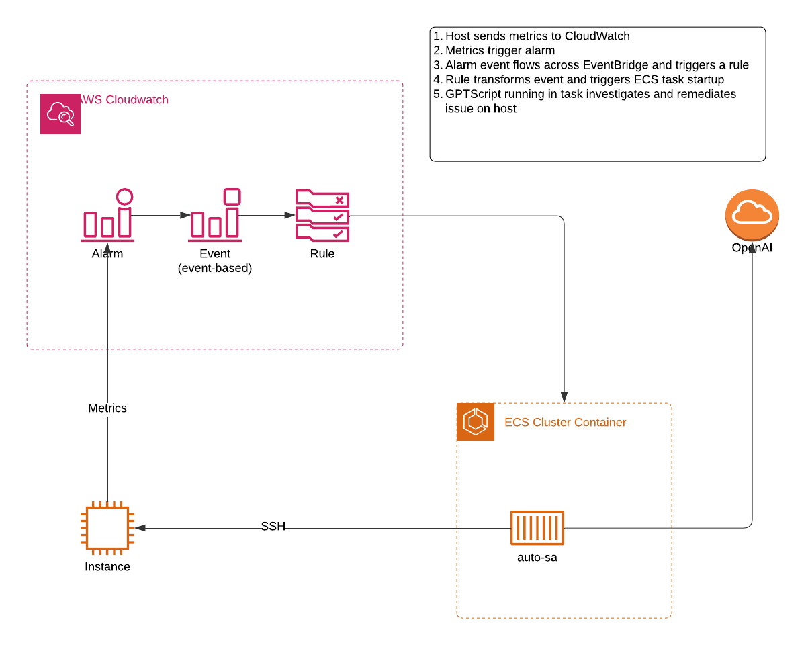
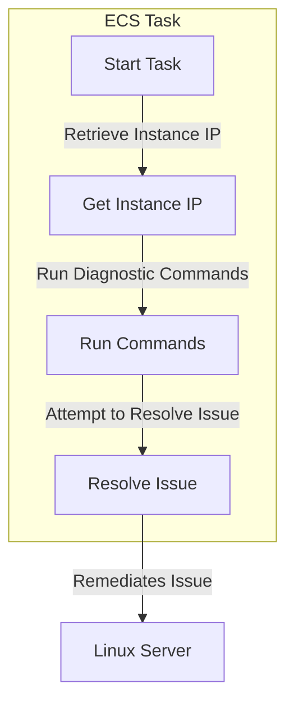

# Auto-SA ECS Job Deployment Guide

This repository deploys Auto-SA as an ECS job that auto remediates CloudWatch alerts on a Linux server using GPTScript as the runtime. It is intended as a tech demo to demonstrate the capabilities of state-of-the-art language models and the GPTScript runtime. **This is not for use in production.**

## Prerequisites

- AWS CLI installed and configured
- AWS Copilot CLI installed
- Docker installed
- An AWS account with necessary permissions

## Step 1: Setting Up AWS Copilot

1. **Initialize Copilot Application:**
   ```sh
   copilot init
   ```
   Follow the prompts to set up your application and environment.

## Step 2: Generating and Storing Secrets

1. **Generate an SSH Key:**
   ```sh
   ssh-keygen -t rsa -b 4096 -f id_rsa
   ```
   Save the key in EC2.

2. **Store the SSH Key in AWS Secrets Manager:**
   ```sh
   aws secretsmanager create-secret --name /copilot/your-app-name/your-env-name/secrets/SSH_KEY --secret-string file://id_rsa
   ```

3. **Store the OpenAI API Key in AWS Secrets Manager:**
   ```sh
   aws secretsmanager create-secret --name /copilot/your-app-name/your-env-name/secrets/OPENAI_API_KEY --secret-string "your-openai-api-key"
   ```

## Step 3: Deploying the Job

1. **Deploy the job using Copilot:**
   ```sh
   copilot deploy
   ```

2. **Verify the deployment:**
   ```sh
   copilot job status
   ```

## Step 4: Build Example EC2 Host

1. **Launch an Amazon Linux EC2 Instance:**
   - Go to the EC2 Dashboard in the AWS Management Console.
   - Click "Launch Instance."
   - Choose the "Amazon Linux 2 AMI" and select an instance type (e.g., t2.micro).
   - Configure instance details, ensuring the instance is in the same VPC as your ECS tasks.
   - Add storage as needed.
   - Configure security group to allow SSH traffic:
     - Add a rule to allow SSH (port 22) from the security group used by your ECS tasks.
   - Review and launch the instance.
   - Use the key you generated earlier

## Step 5: Configure CloudWatch Alarm

1. **Create a CloudWatch Alarm:**
   - Go to the CloudWatch Dashboard in the AWS Management Console.
   - Click "Alarms" in the left-hand menu, then click "Create Alarm."
   - Click "Select metric" and choose "EC2" -> "Per-Instance Metrics."
   - Select the "CPUUtilization" metric for your instance.
   - Click "Select metric" and configure the alarm:
     - **Statistic:** Average
     - **Period:** 1 minute
     - **Threshold type:** Static
     - **Threshold:** Greater than 5%
   - Click "Next" and configure actions:
     - Leave "Send notification to" empty if no actions are needed.
   - Click "Next" and add a name for the alarm (e.g., "auto-sa-cpu").
   - Review and create the alarm.


## Step 6. Configure EventBridge rule to trigger job

1. **Create an EventBridge rule using the AWS Management Console:**
   - Go to the EventBridge Dashboard in the AWS Management Console.
   - Click "Rules" in the left-hand menu, then click "Create rule."
   - Enter a name for the rule (e.g., "auto-sa") and ensure the state is set to "Enabled."
   - Under "Define pattern," select "Event pattern" and choose "Custom pattern (JSON editor)."
   - Enter the following event pattern:
     ```json
     {
       "source": ["aws.cloudwatch"],
       "detail-type": ["CloudWatch Alarm State Change"]
     }
     ```
   - Click "Next" to configure targets.
   - Click "Add target" and select "ECS task" from the dropdown.
   - Configure the target with the following details:
     - **Cluster:** Select your ECS cluster (e.g., `auto-sa-dev-Cluster-Tdrg4c9gvPwk`).
     - **Task Definition:** Select your task definition (e.g., `auto-sa-dev-sa`).
     - **Launch type:** Select "FARGATE."
     - **Task count:** Enter `1`.
     - **Network configuration:** 
       - **Subnets:** Select the public subnets (e.g., `subnet-0be2567f2d3254e28`, `subnet-001292702ac19878d`).
       - **Assign public IP:** Select "ENABLED."
     - **Container overrides:** Click "Edit" and enter the following JSON:
       ```json
       {
         "containerOverrides": [
           {
             "name": "sa",
             "environment": [
               {
                 "name": "ALARM_NAME",
                 "value": "<alarm_name>"
               },
               {
                 "name": "INSTANCEID",
                 "value": "<instanceid>"
               }
             ]
           }
         ]
       }
       ```
     - **Input transformer:** Click "Edit" and enter the following JSON:
       ```json
       {
         "InputPathsMap": {
           "alarm_name": "$.detail.alarmName",
           "instanceid": "$.detail.configuration.metrics[0].metricStat.metric.dimensions.InstanceId"
         },
         "InputTemplate": "{ \"containerOverrides\": [ { \"name\": \"sa\", \"environment\": [ { \"name\": \"ALARM_NAME\", \"value\": \"<alarm_name>\" }, { \"name\": \"INSTANCEID\", \"value\": \"<instanceid>\" } ] } ] }"
       }
       ```
     - **Role:** Select the IAM role (e.g., `Amazon_EventBridge_Invoke_ECS_47688582`).
   - Click "Next" to review the configuration.
   - Click "Create rule" to finalize.


## Additional Information

- **AWS Copilot Documentation:** [AWS Copilot CLI](https://aws.github.io/copilot-cli/)
- **Scheduled Job Manifest Specification:** [Scheduled Job Manifest](https://aws.github.io/copilot-cli/docs/manifest/scheduled-job/)

By following these steps, you will have a scheduled job running on AWS, utilizing Auto-SA with the necessary credentials securely managed. **Remember, this is a tech demo and not intended for production use.**

## Architecture Diagram



## Logic Diagram
